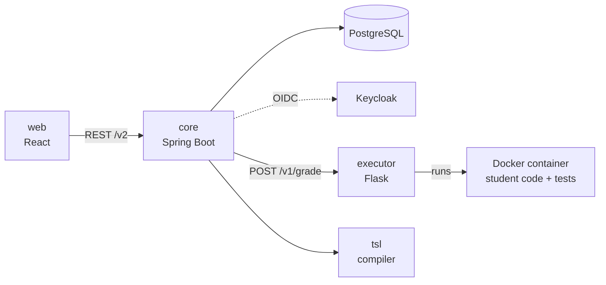

# easy

easy is an educational software platform for managing programming exercises and automatically
assessing solutions.

[Lahendus](https://lahendus.ut.ee/) is a service built on easy, operated by the
[Institute of Computer Science at the University of Tartu](https://cs.ut.ee/en).

easy consists of several applications — some web-based, some desktop, some IDE plugins. This
repository contains the core web application.

## How it fits together



**Grading a submission.** A student submits through the web app (or the Thonny plugin, or the
CLI). `core` picks an executor with spare capacity and posts the submission to it along with the
exercise's grading script, assets, and time and memory limits. The executor runs the whole lot in
a throwaway Docker container and returns a grade and feedback, which `core` stores.

**Authoring an exercise.** A teacher writes tests either as a shell script or in TSL, a
declarative test-spec language of easy's own. The important part: **a TSL spec is compiled to
Python when the exercise is saved**, not when a submission is graded. The generated scripts are
stored alongside the spec as exercise assets, so grading never invokes the compiler — and a spec
the compiler rejects is a failed save rather than a failed submission.

## Repository map

| Path | What it is | Language |
| --- | --- | --- |
| `core/` | The API: exercises, courses, submissions, grading, auth. REST under `/v2`. | Kotlin / Spring Boot |
| `web/` | The web UI teachers and students use. | TypeScript / React / MUI |
| `tsl/` | Compiles a TSL spec into a Python assessment script. | Kotlin |
| `tsl-common/` | The TSL model classes, shared by the compiler and `core`. | Kotlin |
| `aae/` | The auto-assessment executor: runs submissions in Docker containers. | Python / Flask |
| `mock-executor/` | A fake executor for local development — returns whatever grade you tell it to. | Node |
| `ansible/` | Server provisioning and maintenance playbooks. | Ansible |
| `deploy/` | Deploying a CI-built release. | Shell |
| `doc/` | Everything below. | Markdown |
| `archive/` | Dead code kept for reference. Nothing here is built. | — |

The Gradle build covers the JVM side only — `core`, `tsl`, `tsl-common`. `web` is npm and `aae`
is Python; neither is a Gradle project.

## Getting started

Needs **JDK 25**, Node 20+, and Docker.

```sh
docker compose up db                       # PostgreSQL, migrated and seeded
./gradlew bootRun                          # core on :8080
cd web && npm install && npm run dev       # web on :5173
node mock-executor/server.mjs              # a fake executor on :5111
```

**[DEVELOPMENT.md](DEVELOPMENT.md)** has the detail: the two auth modes, running the tests, and
why the test suite refuses to touch a real database.

## Documentation

| | |
| --- | --- |
| [DEVELOPMENT.md](DEVELOPMENT.md) | Running everything locally |
| [doc/testing.md](doc/testing.md) | What the tests cover, what they don't, and what we have none of |
| [doc/web/browser-testing.md](doc/web/browser-testing.md) | The browser test harness and how to add to it |
| [doc/release-procedure.md](doc/release-procedure.md) | Config each environment needs before a deploy, and the release bookkeeping |
| [doc/dev-environment.md](doc/dev-environment.md) | How dev is built, and why |
| [doc/idp-setup.md](doc/idp-setup.md) | Standing up the Keycloak dev IdP from nothing: the machine, the realm, and pointing core at it |
| [doc/java-25-migration.md](doc/java-25-migration.md) | Idioms that changed with Spring Boot 4 and Jackson 3 |
| [doc/bug-reporting.md](doc/bug-reporting.md) | How a bug report gets from the app to a YouTrack issue, and what it carries |
| [doc/core/](doc/core/) | Data migrations, database anonymisation, API testing — each with a runbook |
| [web/README.md](web/README.md) | Frontend build and runtime configuration |
| [ansible/README.md](ansible/README.md) | Provisioning and maintenance |
| [deploy/README.md](deploy/README.md) | Deploying a release |

## Related projects

- Solutions can be submitted straight from [Thonny](https://thonny.org/) (a Python IDE for
  beginners) via the [`thonny-easy` plugin](https://github.com/kspar/thonny-easy).
- [easy-cli](https://github.com/kspar/easy-cli) is a command-line client for automating tasks.
- [easy-py](https://github.com/kspar/easy-py) is the Python SDK both of the above are built on.
- [easy-kc-theme](https://github.com/kspar/easy-kc-theme) is the Keycloak theme Lahendus uses.

## Contributing

Come talk to us on Discord first — the invite is on the
[Lahendus about page](https://lahendus.ut.ee/about).

Issues live in [YouTrack](https://easy.youtrack.cloud). Since v4.0 you can also report one from
inside the app — the account menu has "Report a bug", which files it for you.

**Maintaining one of the grading libraries?** Updating `tiivad`, `silmused` or the other graders needs
a GitHub account and nothing else — see
[Updating a grading library](doc/aae/bumping-a-grading-library.md). The reference for how it all works
is [Grading images](doc/aae/grading-images.md).

## Licence

MIT.
